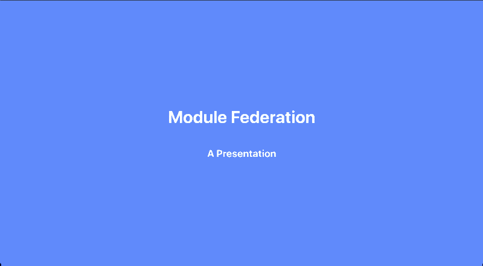

# Module Federation Presentation

This repo is a slideshow presentation outlining the history and use-case of module federation.

#### Note: This app was built with [mdx-deck](https://github.com/jxnblk/mdx-deck)

## Setup

To run in, do the following:

1. run `npm i`
2. npm `npm start`
3. begin navigating with either the left and right arrow keys, or the spacebar

## External Links

- [Webpack 5](https://webpack.js.org/concepts/module-federation/)
- [Micro-Frontends](https://micro-frontends.org/)
- [ThoughtWorks Technology Radar: Micro-Frontends](https://www.thoughtworks.com/radar/techniques/micro-frontends)
- [Micro-Frontends in Action Book](https://livebook.manning.com/book/micro-frontends-in-action/micro-frontends-in-action/7)
- [Tractor Demos](https://the-tractor.store/)
- [This Repo (ooh recursion)](https://github.com/dandrewgarvin/module-federation-masterclass)
- [Module Federation Tutorial with NextJS](https://dev.to/hamatoyogi/let-s-build-micro-frontends-with-nextjs-and-module-federation-41en)

## Credits

- [MDX-Deck](https://github.com/jxnblk/mdx-deck)
- [Carbon](https://carbon.now.sh)
- [Cleanshot](https://cleanshot.com/)
- [TailwindUI / TailwindCSS](https://tailwindui.com/)